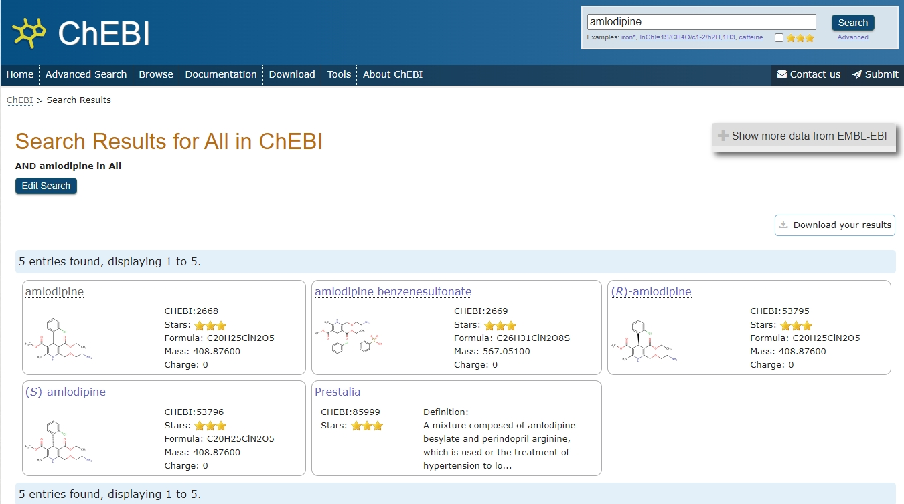

# Find Your Domain Knowledge Bases
## Medical, Clinical, Biomedical, Biotechnology
### NCBI (National Center for Biotechnology Information)
The National Center for Biotechnology Information advances science and health by providing access to biomedical and genomic information.

https://www.ncbi.nlm.nih.gov/

### ClinicalTrials.gov
ClinicalTrials.gov is a place to learn about clinical studies from around the world.

https://clinicaltrials.gov/

### PubMed®
PubMed® comprises more than 37 million citations for biomedical literature from MEDLINE, life science journals, and online books. Citations may include links to full text content from PubMed Central and publisher web sites.

https://pubmed.ncbi.nlm.nih.gov/

### MedlinePlus®

MedlinePlus is an online health information resource for patients and their families and friends. It is a service of the National Library of Medicine (NLM), the world's largest medical library, which is part of the National Institutes of Health (NIH). 

https://medlineplus.gov/

### RxNorm
RxNorm provides normalized names for clinical drugs and links its names to many of the drug vocabularies commonly used in pharmacy management and drug interaction software, including those of First Databank, Micromedex, Multum, and Gold Standard Drug Database. By providing links between these vocabularies, RxNorm can mediate messages between systems not using the same software and vocabulary.

+ RxNav: https://mor.nlm.nih.gov/RxNav/
+ RxNormAPIs: https://lhncbc.nlm.nih.gov/RxNav/APIs/RxNormAPIs.html

### SNOMED-CT
SNOMED-CT is the most comprehensive, multilingual clinical healthcare terminology in the world.

https://browser.ihtsdotools.org/

### NPI (National Provider Identifier)

The National Provider Identifier (NPI) is a Health Insurance Portability and Accountability Act (HIPAA) Administrative Simplification Standard. The NPI is a unique identification number for covered health care providers.

API: https://clinicaltables.nlm.nih.gov/apidoc/npi_org/v3/doc.html

This API uses the NPI (National Provider Identifier) data from CMS (Centers for Medicare & Medicaid Services), the Health Care Provider Taxonomy from NUCC (National Uniform Claim Committee), and the Crosswalk Medicare Provider/Supplier to Healthcare Provider Taxonomy from CMS.

### CVX

CVX includes active and inactive vaccine terms for the United States (US). It also indicates a vaccine’s current availability and the last update time for the vaccine code. Inactive vaccine codes allow users to transmit historical immunization data.

https://www2a.cdc.gov/vaccines/iis/iisstandards/vaccines.asp?rpt=cvx

### LOINC

LOINC is a common language (set of identifiers, names, and codes) for identifying health measurements, observations, and documents. If you think of an observation as a "question" and the observation result value as an "answer."

+ Browser: https://loinc.org/tree/
+ API: https://loinc.org/kb/search-api/

## Chemical
### ChEBI (Chemical Entities of Biological Interest)

Chemical Entities of Biological Interest (ChEBI) is a freely available dictionary of molecular entities focused on ‘small’ chemical compounds.

https://www.ebi.ac.uk/chebi/init.do

## Data, Database, Data Science
### Schema.org

Schema.org is a collaborative, community activity with a mission to create, maintain, and promote schemas for structured data on the Internet, on web pages, in email messages, and beyond.

https://schema.org/

